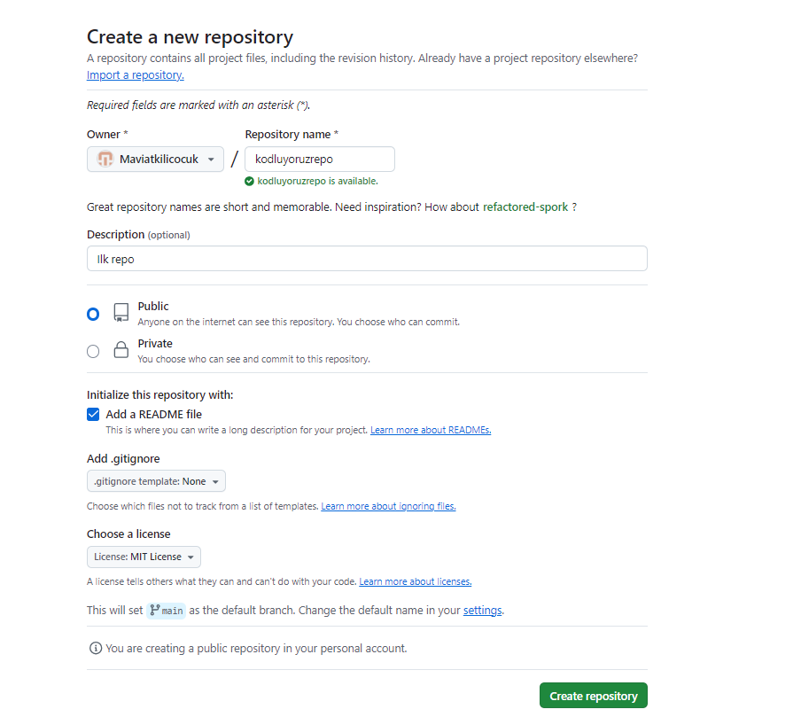

# **Kodluyoruz Ilk Repo**
Bu repo [Kodluyoruz](https://academy.patika.dev/tr/courses/git/odev1) Front-End Eğitiminde oluşturduğumuz ilk repo. İçerisinde bir adet README dosyası, bir adet de index.html barındırıyor.



 ## Installation

Öncelikle projeyi clonelayın.

 ```
 https://github.com/Maviatkilicocuk/kodluyoruzilkrepo.git
 ```

 ## Usage
Projeyi clonladıktan sonra Visual Code programında açınız.

Linux için:

 ```
 cd kodliyoruzrepo
 code.
 ```

 ## Contributing

 Pull requestler kabul edilir. Büyük değişiklikler için, lütfen önce neyi değiştirmek istediğinizi tartışmak için bir konu açınız.

## License

[MIT](https://github.com/Maviatkilicocuk/kodluyoruzilkrepo?tab=MIT-1-ov-file#readme)